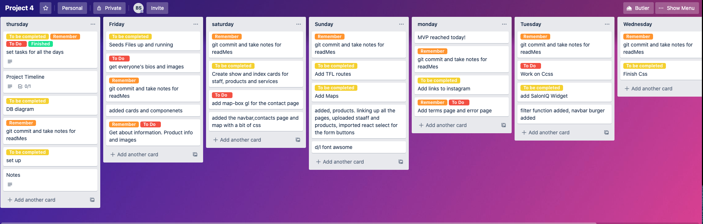
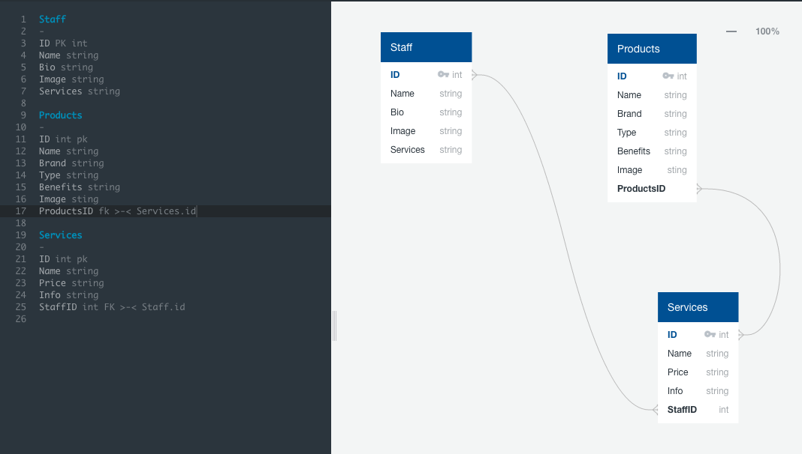
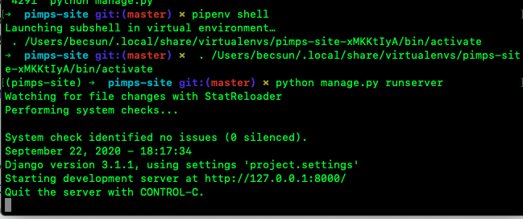
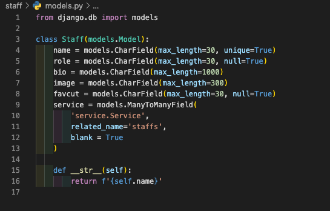
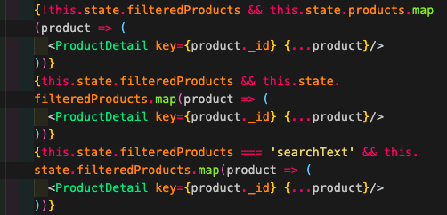
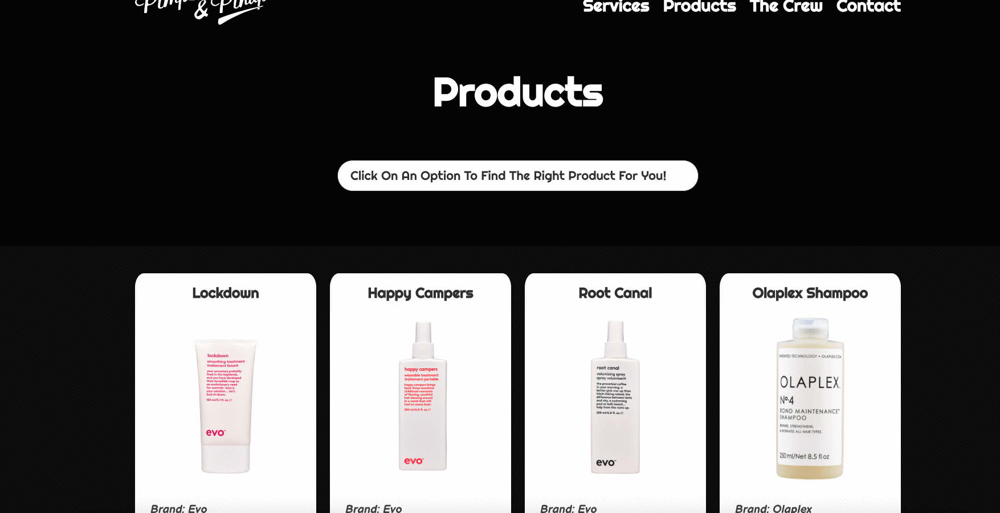

# General Assembly | SEI-49 -project-four

  

 
If you want to have a look at my game, click on:
https://pimps-pinups.herokuapp.com/

## :star2: MyApp

My project was to build a website for my first client who has a salon based in Shoreditch, London.

### Application overview

The client requested to have a few extra features of listing the products they retailed as well as their staff members. I decided to incorporate 2 other features where the user can search for products that suit their needs as well as the suitable stylist for a desired look.

The list for my MVP:
-   **Build a full-stack application** with my own  front and back-end
-   **Use a Python Django API**  using Django REST Framework to serve the data from a Postgres database
-   **Consume the API**  built with React
-   **Implement wireframes** Clear idea of what features are needed
-   **Deploy online**  Make it a live website.

## :hourglass_flowing_sand: Timeframe

7 days

## :clipboard: Planning

Started planning the project out detailing all the daily objectives on the Trello board.

Used QuickDBD to figure out the relationships I would have between the staff to the services and to the services to the products.

## :computer: Technologies Used

* Python

* Django

* JavaScript (ES6)

* CSS3, SCSS, SASS, HTML5

* GitHub and Git

* REACT, React-Router-Dom

* Axios

* Bulma

* PostgreSQL

* Development server: NPM

* Git and GitHub

* TablePlus

* HTTP-proxy-middleware

  

## :shell: Virtual Environment

To use Python I had to create a virtual environment. This is to isolate projects and to keep modules separate from each other.

  

 

Needed to be run in the command line.

  

## :woman_technologist: Linking the many to many relationships.

The data base was created in seperate files. One for services, staff and products. In each file they have a class that represents a table where every attribute of the class is a field of the table. 

 
This is also where the relationship is defined.

##

I implemented a feature to help users find the appropriate products for their hair type. Based on what they chose in the drop down menu bar, the products that are appropriate will be displayed. The code is the function that lets this happen.

## :confounded: Challenges

I found postgreSQL trickier to use compared to MongoDB. I needed to be more structured and make sure that I had all the relationships correct as it is a bit difficult change when there is data in the database. Using Quick DB helped me visualise all the relationships and how to link one to another

## :trophy: Wins

Major win was completing this solo project in a week. Please that I had hit all my objectives that i had set out for the website and also met the client's needs. Enjoyed the whole process thoroughly.

  
## :thought_balloon: Extras

I would eventually like to add:

1. an instagram carousel on each staff member's personal page. It would be a great way to showcase their work.

  
2. Add directions on how to get to the salon.

3. A form in the contacts page for users to send a message directly.

